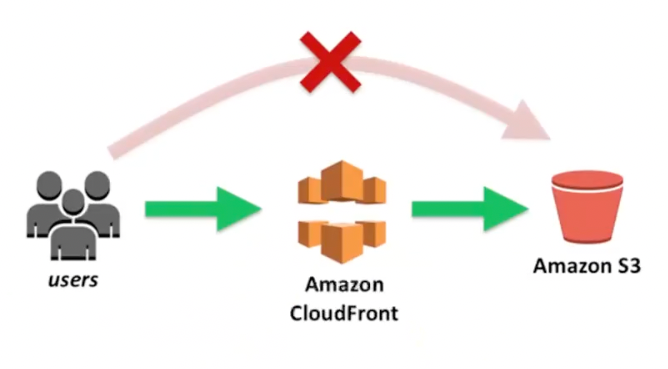

# S3란

파일 저장 서비스

- 우리 사진이나 동영상과 같은 파일들을 구글 드라이브나 iCloud에 저장한다.
- S3는 이런 종류의 서비스라고 생각하면 된다.

## 왜 사용할까?

백엔드 서버를 구현하다보면 이미지 업로드 기능을 구현할 때가 많다. 그럼 이미지 파일을 어디에 저장해야 할까?  
EC2 내부에 이미지 파일을 저장할 수도 있다. 하지만 서비스를 조금만 운영하다보면 EC2에 쌓이는 파일들이 너무 많아지고 지저분해지게 된다.

우리가 휴대폰에 저장공간이 있는데도 블구하고 구글 드라이브나 iCloud와 같은 곳에 사진을 옮기는 이유와 비슷하다.  
S3는 파일 저장에 특화된 서비스이다. 파일 저장 뿐만 아니라 파일을 다운 받는 것에 대해서도 최적화되어 있는 서비스이다.

이러한 이유 때문에 S3를 사용한다. 현업에서 파일 업로드 기능을 구현할 때면 대부분은 AWS S3를 활용한다.

### S3 에서 사용하는 용어 정리

- 버킷(Bucket)이란

> 깃헙을 보면 여러개의 리파지토리를 만들수 있다.  
> S3에서도 여러 개의 저장소를 만들 수 있다.  
> 여기서 하나의 저장소를 버킷이라고 부른다.

- 객체란

> S3에 업로드한 파일을 보고 S3에서는 파일이라 부르지 않고 객체라고 부른다.
> 즉 객체란 S3 버킷에 업로드된 파일을 의미한다.

- 버킷에 정책

> 정책이란 권한을 정의하는 JSON문서를 의미한다. AWS는 기본적으로 대부분의 권한이 주어져있지 않다.  
> AWS의 특정 소스에 접근하려면 권한을 허용해주어야 한다. 권한을 허용할 대 작성해야 하는 게 정책이다.

## S3는 파일 저장 서비스?

- S3는 파일 저장 이외에도 부가적인 기능을 가지고 있다. 그중 하나가 정적 웹사이트 호스팅 기능이다.
- 쉽게 표현하자면 웹 서비스를 다른 사용자들도 쓸 수 있게 인터넷 배포하는 걸 뜻한다.

## CloudFront란

> 한줄 요약: 컨텐츠(파일, 동영상 등)를 빠르게 전송하게 해주는 서비스입니다.

### AWS CloudFront가 어떻게 컨텐츠를 빠르게 전송하게 해주는 지 작동과정

컨텐츠는 S3라는 곳에 저장될 것이다. 하지만 그 S3 저장소가 한국에 있다고 가정하자   
그러면 한국 사용자는 S3와 거리가 가까워 데이터를 빠르게 전송받을 수 있다.   
하지만 미국에 있는 사용자가 S3로 부터 데이터를 전송받으려면 거리가 멀어 시간이 오래 걸리게 된다.

이런 문제를 해결하기 위해 전세계 곳곳에 컨텐츠의 복사본을 저장해 놓을수 있는 임시 저장소를 구축한다.
그러면 미국에 있는 사용자가 컨텐츠를 전송받고 싶을 때, 가장 가까운 임시 저장소에서 컨텐츠를 가져오면  
휠씬 속도가 빨라진다.

이런 형태의 서비스를 보고 `CDN`(Content Delivery Network)이라고 부른다. 그래서 `CloudFront`를  
`CDN` 서비스 라고도 부른다.

## CloudFront는 왜 사용하는 걸까?

S3만 사용해도 웹 서비스를 배포할 수 있다.

그렇다면 `CloudFront`는 왜 필요한걸까?
위의 설명에 따르면 CloudFront는 컨텐츠를 전송 받는 성능을 향상시키기 위해 사용한다.  
그리고 Https를 적용하려면 CloudFront를 사용해야만 한다. `S3에는 Https를 적용시키는 기능을 제공하고 있지 않다.`  
이외에도 보안을 한층 강화할 수 있다는 장점이 있다.

이러한 장점들 덕분에 `S3`와 `CloudFront`를 같이 써서 웹 서비스를 배포한다.

### 현업에서 웹 서비스를 배포할 때 S3, CloudFront를 많이 사용할까?

현업에서 웹 서비스를 배포할 때 실제로 S3와 CloudFront를 많이 활용하고 있다.  
참고로 웹 서비스를 배포할 때 S3, CloudFront도 많이 사용하지만, Netlify, Vercel, CloudFlare와 같은 서비스를  
사용하기도 한다. 이런 서비스가 있다는 것만 알아두자.

## 전체 아키텍처 이해하기

  
[이미지 출처](https://velog.io/@blue03183/S3-Cloudfront-를-사용한-프론트-서버-띄우기)

