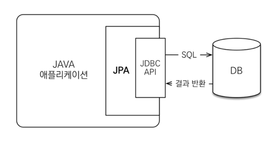

# ORM

- Object-relationl mapping(객체 관계 매핑)
- 객체는 객체대로 설계
- 관계형 DB는 관계형 DB로 설계
- ORM 프레임워크가 중간에 매핑

## JPA는 애플리케이션과 JDBC 사이에서 동작



## 패러다임 불일치 해결

## 1차 캐시와 동일성 보장

1. 같은 트랜잭션 안에서는 같은 엔티티를 반환 - 약간의 조회 성능 향상
2. DB lsolation Level이 Read Commit이어도 애플리케이션에서 Repeatable Read 보장

```java
String memberId = "100";
Member m1 = jpa.find(Member.class, memberId); // SQL
Member m2 = jpa.find(Member.class, memberId); // 캐시
```

```
System.out.println(m1 == m2); // true
```

## 지연로딩과 즉시로딩

- 지연로딩: 객체가 실제 사용될 때 로딩
- 즉시로딩: Join sql로 한번에 연관된 객체까지 미리 조회

> 성능 최적화는 나중에 고민해도된다.  
> 지연로딩으로 먼저 개발 후 성능이 하나의 쿼리로 하면 좋을거 같으면 즉시로딩으로 설정만 해주면 된다.

## JPA 주의
- JPA의 모든 데이터 변경은 트랜잭션 안에서 실행 해야한다.

## JPQL
테이블이 아닌 객체를 대상으로 검색하는 객체지향 쿼리
SQL을 추상화해서 특정 데이터베이스 SQL에 의존하지 않는다.
JPQL을 한마다로 정의하면 객체 지향 SQL 
JPQL은 쿼리 실행시 플러시가 자동으로 호출된다.

- JPA는 SQL을 추상화한 JPQL이라는 객체 지향 쿼리 언어 제공
- SQL 문법 유사, select, from where, group by, having, join 지원
- JPQL은 엔티티 객체를 대상으로 쿼리
- SQL은 데이터베이스 테이블을 대상으로 쿼리


## 1차 캐시
- 엔티티 메니저라는거 데이터베이스 트랜잭션 단위에서 만들고
- 데이터베이스 트랜잭션 끝나면 종료시켜버림
- 고객의 요청이 하나 들어와서 비즈니스가 끝나면 1차 캐시도 함께 사라진다.
- 즉 엄청난 이점은 아니고 복잡한 비즈니스 설계할땐 이점이 될수도 있다.

## 플러시
- 영속성 컨텍스트의 변경내용을 데이터베이스에 반영하는 작업
- 즉 영속성 컨텍스트에 쌓여 있는 내용을 DB와 맞추는 작업
- 영속성 컨텍스트(쓰기지연 SQL 저장소)에 있는 쿼리들을 DB에 전송
- 플러시를 한다해서 1차 캐시는 지워지지않는다.
> 영속성 컨텍스트의 변경내용을 DB에 동기화  
> 트랜잭션이라는 작업 단위가 중요 -> 커밋 직전에만 동기화 하면됨.