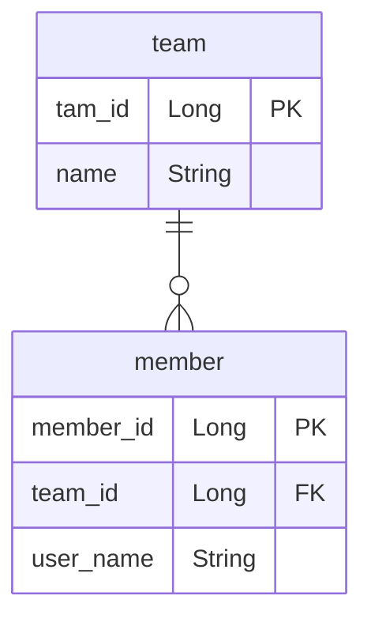

## 객체의 참조와 테이블의 외래 키를 매핑

### 예제 시나리오

- 회원과 팀이 있다.
- 회원은 하나의 팀에만 소속될 수 있다.
- 회원과 팀은 다대일 관계다.

## 테이블 연관관계



## 객체를 테이블에 맞추어 모델링

- 식별자로 다시 조회, 객체 지향적인 방법은 아니다..

```java

@Entity
public class Member {
    @Id
    @GeneratedValue
    private Long id;
    @Column(name = "USERNAME")
    private String name;
    @Column(name = "TEAM_ID")
    private Long teamId;
}

@Entity
public class Team {
    @Id
    @GeneratedValue
    private Long id;
    private String name;
}

public static void main(String[] args) {
    //팀 저장
    Team team = new Team();
    team.setName("TeamA");
    em.persist(team);
    //회원 저장
    Member member = new Member();
    member.setName("member1");
    member.setTeamId(team.getId());
    em.persist(member);
    em.flush();
    em.clear();
    //조회
    Member findMember = em.find(Member.class, member.getId());
    //연관관계가 없음
    Team findTeam = em.find(Team.class, team.getId());
}
```

## 객체 지향 모델링

```java

@Entity
public class Member {
    @Id
    @GeneratedValue
    private Long id;
    @Column(name = "USERNAME")
    private String name;

    // @Column(name = "TEAM_ID")
    // private Long teamId;

    @ManyToOne
    @JoinColumn(name = "TEAM_ID")
    private Team team;

}

public static void main(String[] args) {
    //팀 저장
    Team team = new Team();
    team.setName("TeamA");
    em.persist(team);
    //회원 저장
    Member member = new Member();
    member.setName("member1");
    member.setTeam(team); //단방향 연관관계 설정, 참조 저장
    em.persist(member);
    em.flush();
    em.clear();
    //조회
    Member findMember = em.find(Member.class, member.getId());
    //참조를 사용해서 연관관계 조회
    Team findTeam = findMember.getTeam();
}
```

## 양뱡향 연관관계의 주인

- 외래 키가 있는 곳을 주인으로 정해라
- Member.team이 연관관계의 주인(진짜 매핑)
- Team.Member이 주인의 반대편(가짜 매핑)