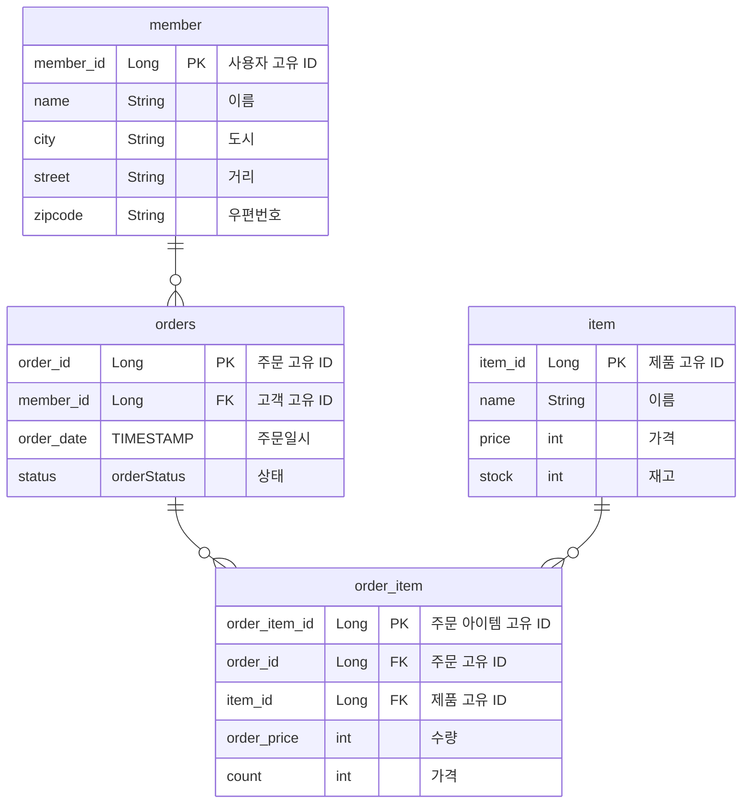

# 요구사항 분석과 기본 매핑

## 요구사항 분석

- 회원은 상품을 주문할 수 있다.
- 주문 시 여러 종류의 상품을 선택할 수 있다.

## 도메인 모델 분석

- 회원과 주문의 관계: 회원은 여러 번 주문할 수 있다.(일대다)
- 주문과 상품의 관계:
    - 주문할 때 여러 상품을 선택할 수 있다.
    - 반대로 같은 상품도 여러 번 주문될 수 있다.
    - 주문상품 이라는 모델을 만들어서 다대다 관계를 일다대, 다대일 관계로 풀어냄

## 엔티티 설계와 매핑



## 데이터 중심 설계의 문제점

- 현재 방식은 객체 설계를 테이블 설계에 맞춘 방식
- 테이블의 외래키를 객체에 그대로 가져옴
- 객체 그래프 탐색이 불가능
- 참조가 없으므로 UML도 잘못됨

```java

@Entity
@Getter
@Setter
@Table(name = "orders")
public class Orders {
    @Id
    @GeneratedValue(strategy = GenerationType.IDENTITY)
    @Column(name = "order_id")
    private Long id;

    @Column(name = "member_id")
    private Long memberId;

    @Column(name = "order_date")
    private LocalDateTime orderDate;

    @Enumerated(EnumType.STRING)
    private OrderStatus status;
}
```

```java

@Entity
@Getter
@Setter
@Table(name = "order_item")
public class OrderItem {
    @Id
    @GeneratedValue(strategy = GenerationType.IDENTITY)
    @Column(name = "order_item_id")
    private Long id;

    @Column(name = "order_id")
    private Long orderId;

    @Column(name = "item_id")
    private Long itemId;

    @Column(name = "order_price")
    private int orderPrice;

    private int count;
}
```

```java

@Entity
@Getter
@Setter
@Table(name = "member")
public class Member {
    @Id
    @GeneratedValue(strategy = GenerationType.IDENTITY)
    @Column(name = "member_id")
    private Long id;

    private String name;
    private String city;
    private String street;
    private String zipcode;

}
```

```java

@Entity
@Getter
@Setter
@Table(name = "item")
public class Item {
    @Id
    @GeneratedValue(strategy = GenerationType.IDENTITY)
    @Column(name = "item_id")
    private Long id;
    private String name;
    private int price;
    private int stock;
}
```

```java

public enum OrderStatus {
    ORDER, CANCEL
}
```


## 연관관계 매핑
- 참조를 사용하도록 변경

```java

@Entity
@Getter
@Setter
@Table(name = "member")
public class Member {
    @Id
    @GeneratedValue(strategy = GenerationType.IDENTITY)
    @Column(name = "member_id")
    private Long id;

    private String name;
    private String city;
    private String street;
    private String zipcode;

    @OneToMany(mappedBy = "member")
    private List<Orders> orders = new ArrayList<>();
}
```
```java
@Entity
@Getter
@Setter
@Table(name = "orders")
public class Orders {
  @Id
  @GeneratedValue(strategy = GenerationType.IDENTITY)
  @Column(name = "order_id")
  private Long id;

  @ManyToOne
  @JoinColumn(name = "member_id")
  private Member member;

  @OneToMany(mappedBy = "orders")
  private List<OrderItem> orderItems = new ArrayList<>();

  public void addOrderItem(OrderItem orderItem){
    orderItems.add(orderItem);
    orderItem.setOrders(this);
  }
  
  @Column(name = "order_date")
  private LocalDateTime orderDate;

  @Enumerated(EnumType.STRING)
  private OrderStatus status;
}
```
```java
@Entity
@Getter
@Setter
@Table(name = "order_item")
public class OrderItem {
  @Id
  @GeneratedValue(strategy = GenerationType.IDENTITY)
  @Column(name = "order_item_id")
  private Long id;

  @ManyToOne
  @JoinColumn(name ="order_id")
  private Orders orders;

  @ManyToOne
  @JoinColumn(name ="item_id")
  private Item item;

  @Column(name = "order_price")
  private int orderPrice;

  private int count;
}
```
```java
@Entity
@Getter
@Setter
@Table(name = "item")
public class Item {
  @Id
  @GeneratedValue(strategy = GenerationType.IDENTITY)
  @Column(name = "item_id")
  private Long id;
  private String name;
  private int price;
  private int stock;
}

```
## 핵심
- 연관관계의 주인이 아닌 경우엔 조회만 가능하다.
- 단방향으로 작성 후 필요할 때 양방향을 고려해봐라.
- JPQL을 사용하다 보면 양뱡향을 걸게 된다.
- 핵심은 최대한 단방향으로 해라.

```java
    @OneToMany(mappedBy = "member")
    private List<Orders> orders = new ArrayList<>();
```
> 잘못된 코드라 생각한다. member를 보고 member의 orders를 꺼낼 일 있을까?  
> member를 조회하고 orders를 따로 조회하는게 설계 깔끔하다.
